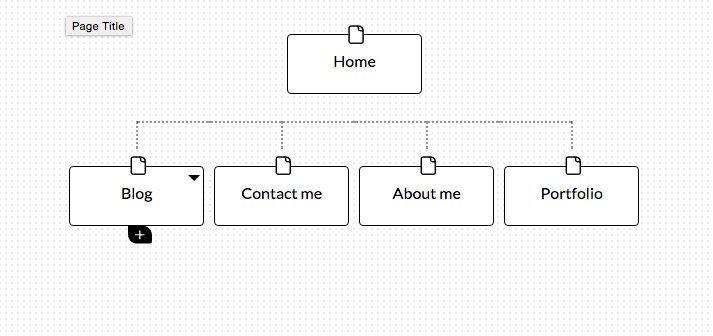

What are the 6 Phases of Web Design?

The first phase of web design is to gather information about the purpose of the site. Who will be the target audience? Is this trying to sell a product, offer a service or share information? What kind of information will the target audience look for on the site? What are the company's or individual's goal with building the site? A solid understanding of these questions is crucial.

The second phase is to plan out the outline of the site using the information gathered in phase 1. It is very useful to create a sitemap in this phase. The developer should also begin thiking about the technologies that will be best for the kind of purpose the site has.

The third phase is design. For this phase it is crucial to keep in mind the target audience as different demographics will find more appealing different aesthetics and features. A mock (usually saved as an .jpg image) is useful at this stage to give the party the site is for a chance to talk with the developer about what things they like and dislike until they are satisfied.

The fourth phase is development. Once the visual design is ready it is time to actually make a functional site with the design. At this stage a home page is developed first followed by a "shell" of the interior pages. Interactive elements are also made functional at this stage.

The fifth phase is testing and delivery. In this stage the developer will make sure that all aspects of the site are functional (across all platforms the site is meant to work on) and check in with the costumer about desired final details and changes. It is important for the developer to make sure that the site is up to date with the latest web development standards. When there's no doubt everything is running the way it is supposed to an Fite Transfer Protocol (FTP) programs is used to upload the site to the server. Some developers offer hosting and all developers should at least know about the ideal server their client should host their site on.

The sixth phase is maintenance. A good site is not written in stone but rather evolving in accordance with a dynamic target audience and new technologies, or simply new content as the owners of the site are also constantly changing and growing. To maintain a site a client can user a Content Management System (CMS)(if previously decided during the planning stage) or give all maintenance responsabilities to the developer.

What is your site's primary goal or purpose? What kind of content will your site feature?

My site's primary purpose is to be the medium by which potential employers look at my portfolio and personal profile.

What is your target audience's interests and how do you see your site addressing them?

My target audience's main interests will be the work I have done in order to evaluate my technical knowledge and skills. My site will have a section for my portfolio with proyects that I am proud of and they will be in chronilogical order.

What is the primary "action" the user should take when coming to your site? Do you want them to search for information, contact you, or see your portfolio? It's ok to have several actions at once, or different actions for different kinds of visitors.

The two main actions users on my site will be doing (hopefully) are seeing my portfolio and contacting me. My personal blog will be a secondary aspect of my site where I will share my experience as a beginner going into this challenging and competitive world of development.

What are the main things someone should know about design and user experience?

The purpose of the site and the target audience. These two things, in my opinion, are relevant from the very beginning of the development process until the very end and beyond. 

What is user experience design and why is it valuable? 

UXD is the philosophy of shaping a site with the idea that design decisions shoud be made based on the needs and wants of the user. In this day and age with the www having over three billion users it is important to make a site as user friendly as possible as the expectations of web navigation and technological advances are constantly on the rise. From a business perspective it is also logical to design on what the client wants and needs rather than on the client's or developer's, as these can be very different.

Which parts of the challenge did you find tedious?

As I am already fairly comfortable with the git workflow and the terminal no aspect of this challenge was particularly tedious.

