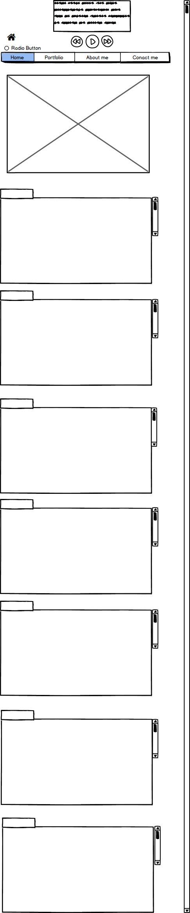

What is a wireframe?

A wireframe is a sketch of your website. Wireframes are meant to be focused on the way information will be displayed to the user and not much on the aesthetic aspect of the site (they are usually black and white). 

What are the benefits of wireframing?

Wireframinh gives the developer a good idea of all the technologies they will have to use to achieve theat specific information flow and display. 

Did you enjoy wireframing your site?

I downloaded Balsamiq Mockups which was very easy to use as you simply drag and drop elements directly into a grid.

Did you revise your wireframe or stick with your first idea?

Given that at this stage my site is fairly simple I stuck with the first idea.

What questions did you ask during this challenge? What resources did you find to help you answer them?

I overlooked that Balsamiq gives you the option to export your file to PNG format the first time I saved it, so I had to goole "Balsamiq mockups file to image".

Which parts of the challenge did you enjoy and which parts did you find tedious?

I enjoyed wireframing and to be honest I did not get stuck in any aspect of this challege.