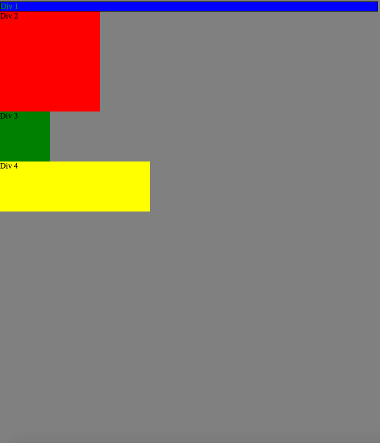
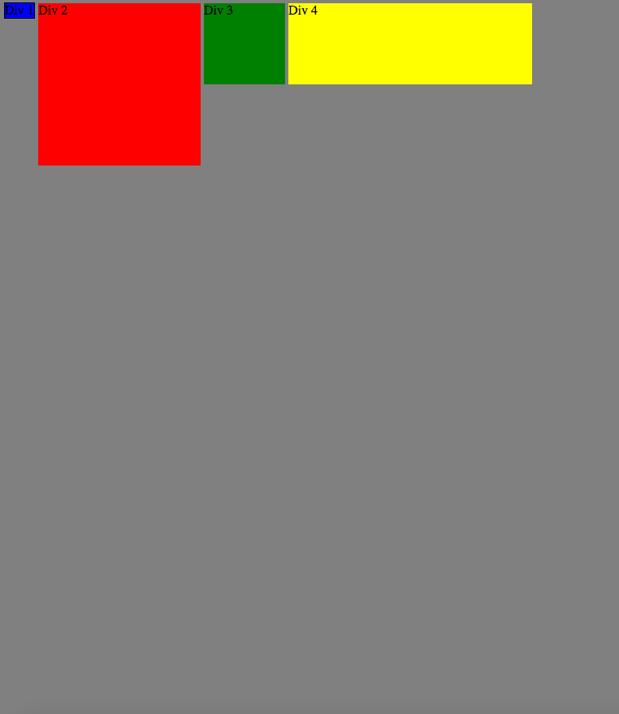
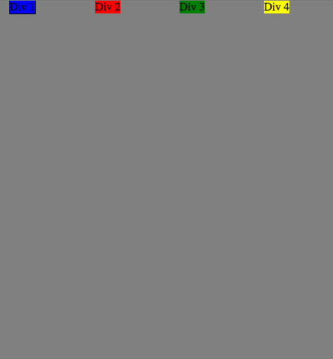
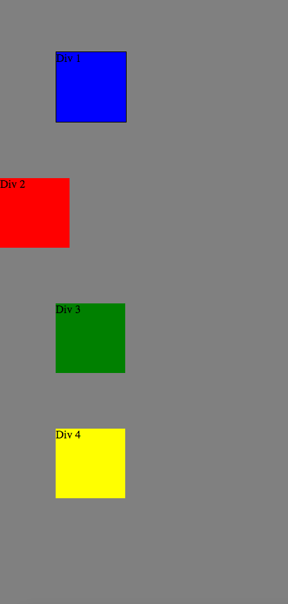
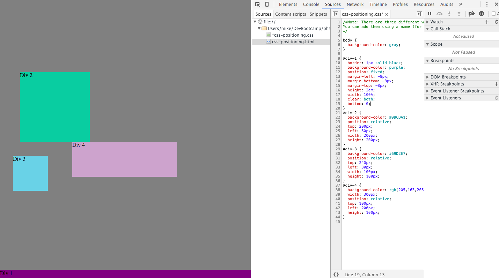
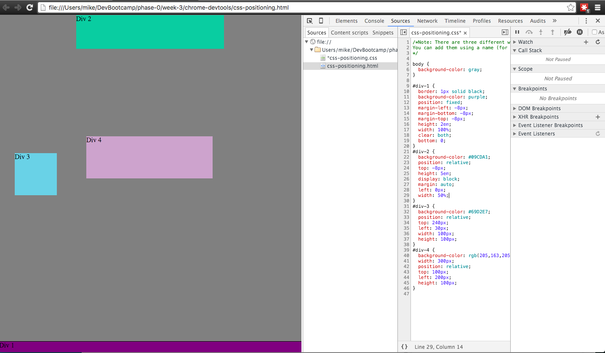
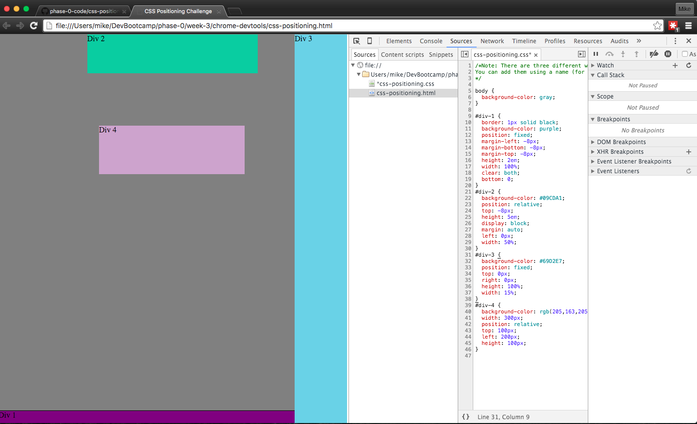
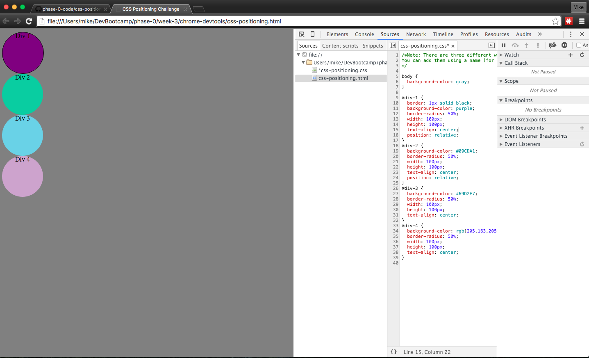

How can you use Chrome's DevTools inspector to help you format or position elements?

With Devtools inspector it is easier to format elements for several reasons. The main one being that it allows you to see what a piece of CSS is affecting in real time. It also allows you to simply double click on a property to change it which saves you some time. Another cool thing about Chrome devtools is the fact that you can look at the code for any website you visit.

How can you resize elements on the DOM using CSS?

You can resize elements using the width and height properties.

What are the differences between absolute, fixed, static, and relative positioning? Which did you find easiest to use? Which was most difficult?

An element set to static will not be affected by the top, bottom, left and right properties.
A fixed element will stay in the same place relative to the user's screen, so if I make a header fixed it will stay there even when I scroll down.
An element set to absolute will be positioned relative to the nearest ancestor.
An element set to relative willbe affected by the top, right, bottom and left properties and other elements will not be adjusted to fit into any gaps left by the element.

What are the differences between margin, border, and padding?

The border can be thought of as what marks where an element begins and ends. Padding refers to the space between the border and the content itself and the margin refers to the space between the border and a arbitrarily defined extension of the element.

What was your impression of this challenge overall? (love, hate, and why?)

I liked this challenge because we found ourselves in a position where we could think from the top of our heads how to solve something but we still had to do some research and in the process learned some new things and solified some concepts.

