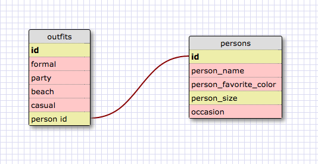

What are databases for?

They help us store information in a meaningful and neat way.

What is a one-to-many relationship?

When one x has a single y and a y has many x. For example,
one state has one region, and one region has many states.

What is a primary key? What is a foreign key? How can you determine which is which?

A primary key is one that is being used isnide it own table, while a foreign key is being connected from another table.

How can you select information out of a SQL database? What are some general guidelines for that?

with command the commands SELECT and FROM. It really helped me,
to think of it as if I were writing out a sentence in english when it came to writing out the logic for selecting specific criteria.

