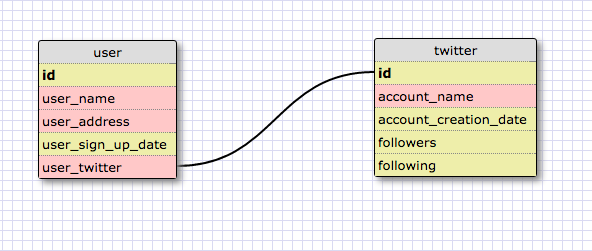
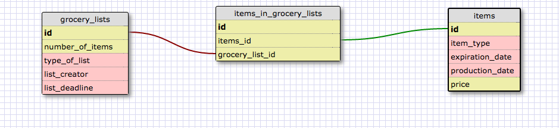

What is a one-to-one database?

A one to one database can be described as follows:
x has only one y and y only has one x.

When would you use a one-to-one database? (Think generally, not in terms of the example you created).

When you might want to split a single table into two in order to specify somethings about a piece of data.

What is a many-to-many database?

A many to many database can be described as follows:
x has many y and y has many x.

When would you use a many-to-many database? (Think generally, not in terms of the example you created).

When you want to join two tables in order to pair relevant pieces of data.

What is confusing about database schemas? What makes sense?

I think I grasp the concepts pretty well.

